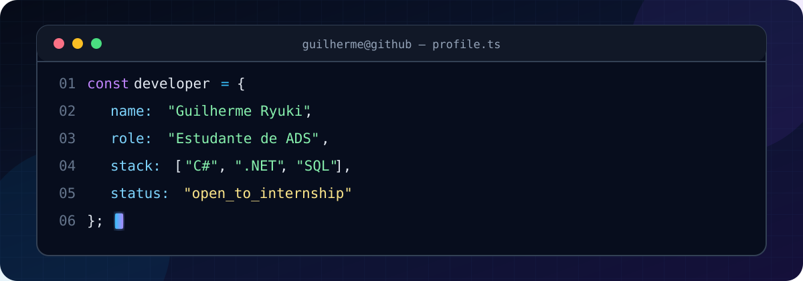

<div align="center">
  
</div>

<p align="center">
  <code>São Paulo, SP</code>
  &nbsp;•&nbsp;
  <code>FECAP — ADS</code>
  &nbsp;•&nbsp;
  <code>Disponível para estágio</code>
</p>

## `$ whoami`

Sou estudante do **2º semestre de Análise e Desenvolvimento de Sistemas na FECAP**. Estou construindo minha base em desenvolvimento de software por meio de projetos acadêmicos e prática constante.

Meu foco atual é compreender bem os fundamentos de **C#, .NET e bancos de dados**, evoluindo com honestidade: ainda estou no início da carreira, mas gosto de transformar o que aprendo em projetos que possam ser vistos, testados e melhorados.

```yaml
perfil:
  nome: Guilherme Ryuki Kawahira
  objetivo: estágio em tecnologia
  interesses:
    - desenvolvimento de software
    - aplicações desktop
    - banco de dados
    - desenvolvimento web
  modo_atual: aprender → praticar → documentar → evoluir
```

## `$ ls ./toolbox`

**Conhecimento prático básico**


**Em aprendizado**


## `$ git log --featured`

### `commit 01` · [Messier — Protótipo Desktop](https://github.com/GuiRyuki/PrototipoMessier)

> Aplicação acadêmica para gestão e acesso de escolas a jogos educacionais.

```text
stack       C# · .NET 8 · Windows Forms
features    login por perfil · catálogo · pacotes · relatórios
aprendizado interfaces desktop · eventos · navegação entre telas
status      protótipo acadêmico em evolução
```

### `commit 02` · [Estudos de Programação](https://github.com/GuiRyuki/treinando)

> Registro da minha evolução nos fundamentos da programação.

```text
conteúdo    lógica · Portugol · VisuAlg · banco de dados
objetivo    praticar fundamentos e documentar o aprendizado
status      atualizado conforme avanço no curso
```

## `$ cat learning.log`

- `[em andamento]` **CS50's Web Programming with Python and JavaScript — Harvard**
- `[concluído]` **Pacote Office — Fundação Bradesco**
- `[concluído]` **Pensamento Computacional — Fundação Bradesco**
- `[agora]` aprofundando C#, .NET, CRUD, SQL e integração com bancos de dados

## `$ ./connect.sh`

<div align="center">

[](https://github.com/GuiRyuki)

```text
> Sempre aprendendo. Um commit de cada vez.
```

</div>
